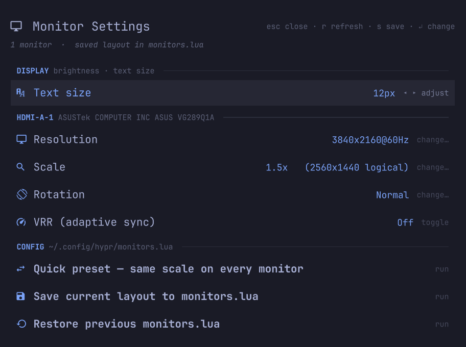
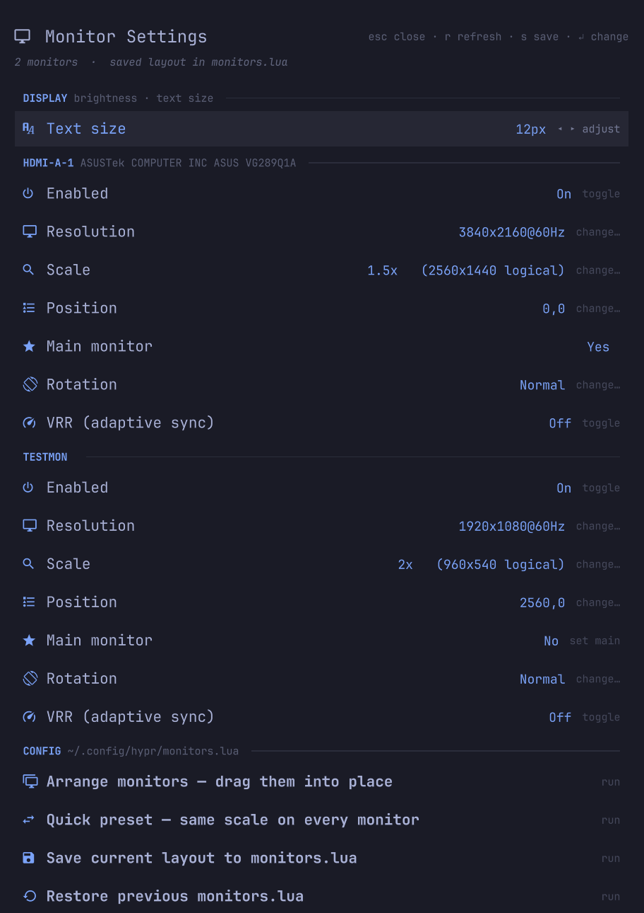
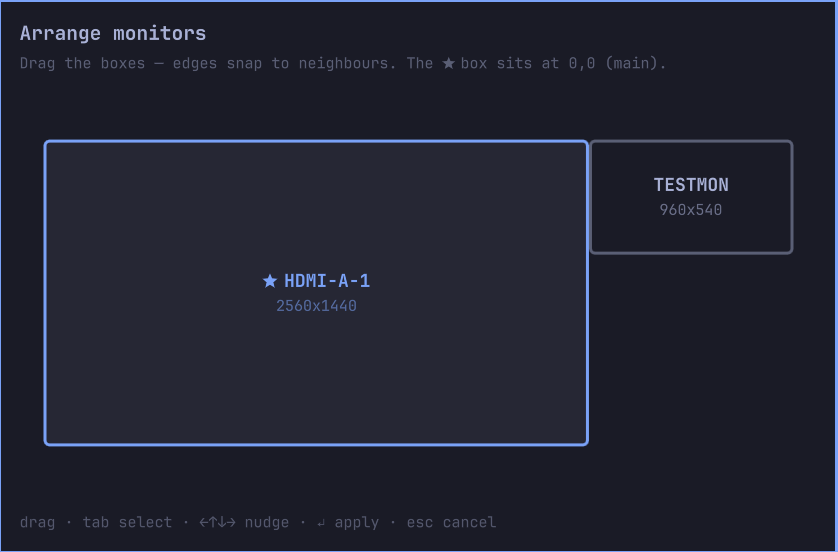

# Monitor Settings — Omarchy plugin

A native [omarchy-shell](https://omarchy.com) plugin for managing monitor settings on Omarchy 4 (Hyprland). One panel for everything display: brightness, text size, and per-monitor resolution, refresh rate, scaling, position, rotation, VRR and on/off — no terminal, no config editing.

It's a superset of the stock **Display** panel, so on first open it retires the first-party `omarchy.monitor` bar icon (once — see [One display panel, not two](#one-display-panel-not-two)).

<p align="center">
  
</p>

With more than one monitor, every display gets its own section — including on/off, position, and a main-monitor switch — and the arrangement editor lets you drag them into place:

<p align="center">
  
</p>

<p align="center">
  
</p>

> **This project used to be a bash TUI** (`monitor-tui.sh`). It is now a QML panel with a bar icon, installed through Omarchy's plugin system. The old TUI lives in git history at tag `v0.1-tui` — if you had it installed, see [Migrating from the TUI](#migrating-from-the-tui).

## Install

```bash
omarchy plugin add https://github.com/28allday/Monitor-TUI-Omarchy.git
```

Say yes to enabling it and pick a bar section — a 󰍹 icon appears in the bar. Click it to open the panel.

Optionally bind a key in `~/.config/hypr/bindings.lua`:

```lua
o.bind("SUPER + ALT + M", "Monitor settings", "omarchy-shell shell toggle nosignal.monitor-settings")
```

## Features

| Feature | Description |
|---------|-------------|
| **Brightness** | Laptop backlight or DDC/CI for external monitors, on the focused display — `←`/`→` nudges in 5% steps. The row only appears when a controllable backlight exists |
| **Text size** | The shell/app base font size, same stops as the stock Display panel |
| **Resolution** | Pick from all modes your monitor reports (deduplicated, refresh rounded) |
| **Refresh rate** | Part of the mode picker — 60Hz, 144Hz, 240Hz, whatever the panel offers |
| **Scaling** | Presets from 1x to 2x, including the fractional ones Hyprland accepts |
| **Position** | Auto, left/right/above/below the other monitors — coordinates computed from their *logical* (scaled, rotated) sizes |
| **Arrange** | A to-scale mini-map of your monitors — drag them into place (or tab + arrows), edges snap to neighbours, ↵ applies live |
| **Main monitor** | One keypress puts a monitor at 0,0 — where the first workspace and fullscreen games land — shifting the others to keep the layout |
| **Rotation** | Normal, 90°, 180°, 270° |
| **VRR** | Toggle Variable Refresh Rate (FreeSync/G-Sync) per monitor |
| **Display on/off** | Enable/disable individual monitors (the last enabled one is protected) |
| **Live preview** | Every change applies instantly — nothing touches disk until you save |
| **Save / restore** | One row writes the live layout into a marked block in `monitors.lua` (backing up the file first); another restores the backup. Disabled monitors are saved disabled |
| **Quick presets** | Apply the same scale to every monitor at its preferred resolution |

## One display panel, not two

This panel does everything the first-party **Display** panel (`omarchy.monitor`) does, so running both means two bar icons with overlapping jobs. On its first open, the plugin disables the first-party icon — exactly once, recorded in `~/.local/state/nosignal-monitor-settings/`. If you want the stock panel back:

```bash
omarchy plugin enable omarchy.monitor
```

and it stays back — the marker stops the plugin from taking it away again.

The stock `SUPER + CTRL + D` binding targets the first-party panel, so re-point it in `~/.config/hypr/bindings.lua`:

```lua
o.bind("SUPER + CTRL + D", "Display", "omarchy-shell shell toggle nosignal.monitor-settings")
```

## How it works

1. Reads live monitor data straight from Hyprland
2. Picking a value applies it immediately — the panel marks the session as having unsaved changes
3. **Save current layout** writes what's actually on screen into a clearly-marked block in `~/.config/hypr/monitors.lua` (the file Omarchy 4 loads), keeping the previous file as `monitors.lua.bak`. Your own lines outside the block are untouched
4. **Restore previous monitors.lua** puts the backup back and reloads

Because nothing is written until you save, a change that goes wrong is undone by picking the old value again — or closing the panel and running `hyprctl reload`.

## Keys

`↑↓`/`jk` move · `←→`/`hl` adjust sliders · `↵` change / toggle / run · `s` save · `r` refresh · `esc` close

## Dependencies

Everything ships with Omarchy 4: `hyprctl`, `jq`, and omarchy-shell itself. There is nothing to install.

## Migrating from the TUI

If you installed the old `monitor-tui.sh` (≤ v0.1), remove its keybinding and installed script first:

```bash
./monitor-tui-uninstall.sh
```

The old `monitors.conf` the TUI wrote is ignored by Omarchy 4 anyway — the plugin saves to `monitors.lua`, the file Hyprland actually reads.

## Uninstall

```bash
omarchy plugin remove nosignal.monitor-settings
omarchy plugin enable omarchy.monitor   # bring the stock Display icon back
```

## Video guide (legacy TUI)

The original video shows the old terminal version. The workflow is the same — pick a monitor, pick a setting, save — just prettier now.

<p align="center">
  <a href="https://youtu.be/RDp3u_eZNa4">
    
  </a>
</p>

## Licence

MIT
